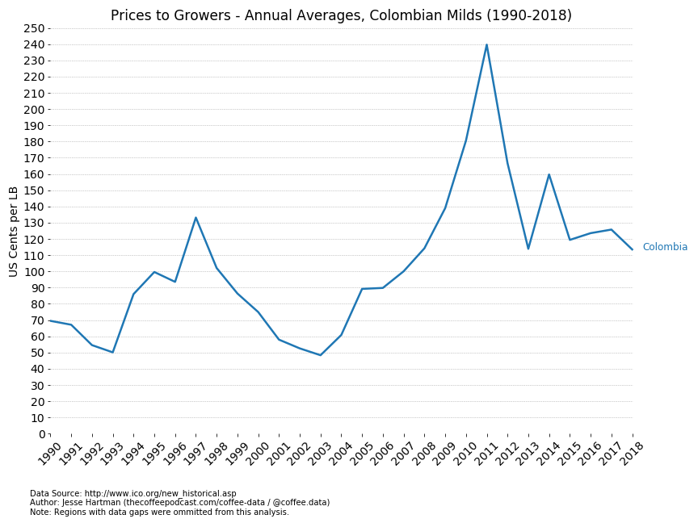
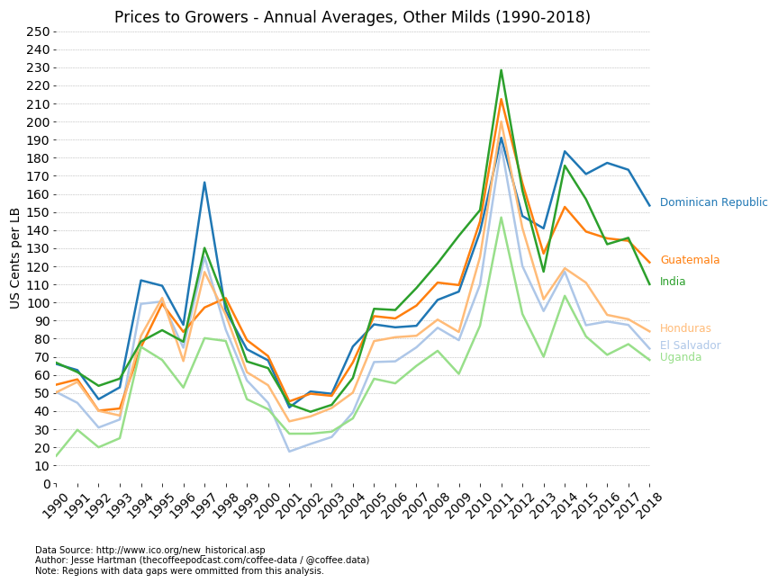
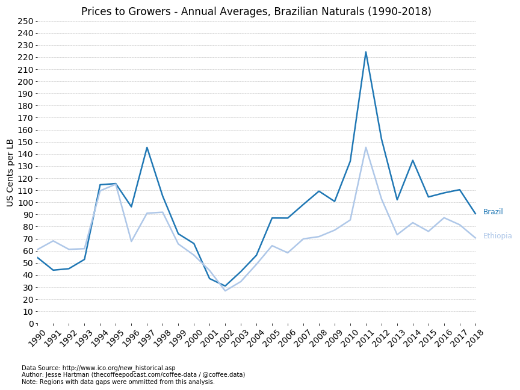
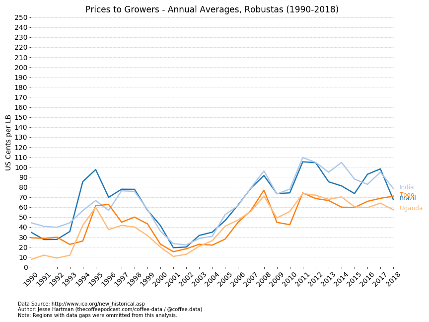

# A look at ICO Historical Data
The International Coffee Organization (ICO) is one of coffee's oldest data collection agents. This project looks at the publically available historical data at http://www.ico.org/new_historical.asp and creates graphs to (1) visualize that data and (2) reference the visualization for futrher analysis.

An important glossary of terms is located here: http://www.ico.org/glossary.asp

## Step 1 - Clean the data.
Because the data source was available in .xlsx with an obvious presentation purpose in mind, the data had to be sepatrated into new sheets with specified categories and saved as .csv. With Python and Jupyter Notebooks, the data was further cleaned and then prepared for some plotting with MatplotLib.

There were significant chunks of data missing from the source. I decided to discard any sets of data within the sources that were missing data.

To keep the visualizations consistent, I changed US dollar values to US cents values.

## Step 2 - Visualize the data in line graphs.
Because we are looking at y_value over time (1990-2018), a line graph was best suited for a first glance. 

To be continued...

